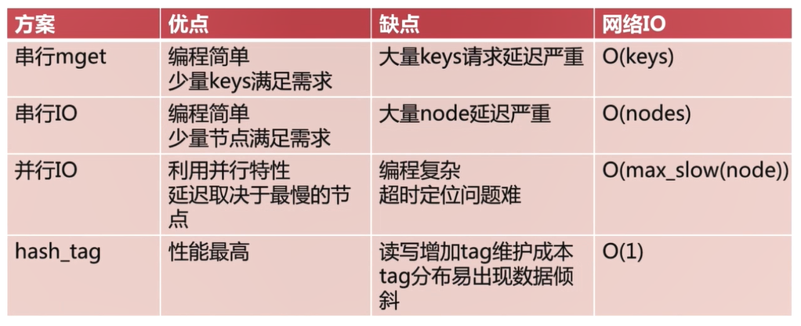

* 客户端分片
* 服务端分片
* 中间件分片

### 主从复制（哨兵  ）
#### 简单的主从复制

* 从服务器连接主服务器，发送SYNC命令；
* 主服务器接收到SYNC命名后，开始执行BGSAVE命令生成RDB文件并使用缓冲区记录此后执行的所有写命令；
* 主服务器BGSAVE执行完后，向所有从服务器发送快照文件，并在发送期间继续记录被执行的写命令；
* 从服务器收到快照文件后丢弃所有旧数据，载入收到的快照；
主服务器快照发送完毕后开始向从服务器发送缓冲区中的写命令；
从服务器完成对快照的载入，开始接收命令请求，并执行来自主服务器缓冲区的写命令；（从服务器初始化完成）
* 主服务器每执行一个写命令就会向从服务器发送相同的写命令，从服务器接收并执行收到的写命令（从服务器初始化完成后的操作）

##### 优点
支持主从复制，主机会自动将数据同步到从机，可以进行读写分离
Slave同样可以接受其它Slaves的连接和同步请求，这样可以有效的分载Master的同步压力。

Master Server是以非阻塞的方式为Slaves提供服务。所以在Master-Slave同步期间，客户端仍然可以提交查询或修改请求。
Slave Server同样是以非阻塞的方式完成数据同步。在同步期间，如果有客户端提交查询请求，Redis则返回同步之前的数据

##### 缺点
Redis不具备自动容错和恢复功能，主机从机的宕机都会导致前端部分读写请求失败，需要等待机器重启或者手动切换前端的IP才能恢复。

主机宕机，宕机前有部分数据未能及时同步到从机，切换IP后还会引入数据不一致的问题，降低了系统的可用性。
Redis较难支持在线扩容，在集群容量达到上限时在线扩容会变得很复杂。

#### 哨兵机制

当主服务器中断服务后，可以将一个从服务器升级为主服务器，以便继续提供服务，但是这个过程需要人工手动来操作。 为此，Redis 2.8中提供了哨兵工具来实现自动化的系统监控和故障恢复功能。

哨兵的作用就是监控Redis系统的运行状况。它的功能包括以下：
* 监控：哨兵会不断地检查主节点和从节点是否运作正常。
* 自动故障转移（核心功能）：当主节点不能正常工作时，哨兵会开始自动故障转移操作，它会将失效主节点的其中一个从节点升级为新的主节点，并让其他从节点改为复制新的主节点。
* 配置提供者：客户端在初始化时，通过连接哨兵来获得当前Redis服务的主节点地址。
* 通知：哨兵可以将故障转移的结果发送给客户端。

`哨兵集群的组建`  是通过主库 的`__sentinel__:hello` 频道通信(pub/sub模式)，不同的哨兵就是通过他来相互通信的。多个哨兵节点订阅主库的`__sentinel__:hello`，并发送自己的ip和端口，这样其他哨兵就能知道彼此的地址进行连接形成哨兵集群。
哨兵监控redis库是通过给主库发送info命令来判断的，主库返回所有从库的信息，这样哨兵节点就可以和每个从库建立连接，持续的对主库和从库监控。

主库下线判断由主管下线和客观下线两种状态判断，当一个哨兵节点判断主库下线，那么此时主库为主观下线，当前哨兵判断主库“主观下线”后，就会给其他哨兵发送 `is-master-down-by-addr` 命令。接着，其他哨兵会根据自己和主库的连接情况，做出 Y 或 N 的响应，`Y` 相当于赞成票，`N` 相当于反对票，当赞同的数量超过配置中的`quorum` 值时就认为主库客观下线。

`哨兵集群的选举`由aft选举算法实现。 选举的票数大于等于num(sentinels)/2+1且大于等于哨兵配置文件中的 `quorum` 值时（两个条件缺一不可），将成为领导者，否则继续选举。选择出的哨兵节点用来执行集群主库的重新选举。

`新主库的选举`：
* 过滤掉不健康的（下线或断线），没有回复过哨兵ping响应的从节点。
* 选择salve-priority从节点优先级最高（redis.conf中）的。
选择复制偏移量最大，只复制最完整的从节点。

##### 优点
哨兵模式是基于主从模式的，所有主从的优点，哨兵模式都具有。
主从可以自动切换，系统更健壮，可用性更高。

##### 缺点
Redis较难支持在线扩容，在集群容量达到上限时在线扩容会变得很复杂

###  Redis Sharding

Redis Sharding是一种客户端Sharding分片技术。

Redis Sharding可以说是Redis Cluster出来之前，业界普遍使用的多Redis实例集群方法。主要思想是采用哈希算法将Redis数据的key进行散列，通过hash函数，特定的key会映射到特定的Redis节点上。

这样，客户端就知道该向哪个Redis节点操作数据,需要说明的是，这是在客户端完成的。

采用一致性hash和虚节点的方式可以保证当增加或减少节点时，不会产生由于重新匹配造成的rehashing和数据均衡。

Redis Sharding采用客户端Sharding方式，服务端的Redis还是一个个相对独立的Redis实例节点。同时，我们也不需要增加额外的中间处理组件，这是一种非常轻量、灵活的Redis多实例集群方案。如果可能会增加机器可以考虑preshading 方式。

###  Redis Cluster

https://www.cnblogs.com/williamjie/p/11132211.html

Redis Cluster 功能 ： 负载均衡，故障切换，主从复制 
槽;集群中每个redis实例都负责接管一部分槽，总槽数为：16384（2^14），如果有3台master，那么每台负责5461个槽（16384/3）。

当redis客户端设置值时，会拿key进行CRC16算法，然后 跟16384取模，得到的就是落在哪个槽位，根据上面表格就得出在哪台节点上。槽公式如下：
`slot = CRC16(key) & 16383`

Redis集群中，每个节点都会有其余节点ip，负责的槽 等 信息。
Gossip协议的主要职责就是信息交换。信息交换的载体就是节点彼此发送的Gossip消息，常用的Gossip消息可分为：ping消息、pong消息、meet消息、fail消息等。

#### 集群的工作方式

* 每个节点通过通信都会共享Redis Cluster中槽和集群中对应节点的关系
* 客户端向Redis Cluster的任意节点发送命令，接收命令的节点会根据CRC16规则进行hash运算与16383取余，计算自己的槽和对应节点
* 如果保存数据的槽被分配给当前节点，则去槽中执行命令，并把命令执行结果返回给客户端
* 如果保存数据的槽不在当前节点的管理范围内，则向客户端返回moved重定向异常
* 客户端接收到节点返回的结果，如果是moved异常，则从moved异常中获取目标节点的信息
* 客户端向目标节点发送命令，获取命令执行结果

#### 迁移时的工作方式
* 客户端向目标节点发送命令，目标节点中的槽已经迁移到其他的节点上了，此时目标节点会返回ask转向给客户端
* 客户端向新的节点发送Asking命令给新的节点，然后再次向新节点发送命令
* 新节点执行命令，把命令执行结果返回给客户端

moved异常与ask异常的相同点是两者都是客户端重定向；
不同点是
* moved异常：槽已经确定迁移，即槽已经不在当前节点，
* ask异常：槽还在迁移中

为了保证高可用，每个主节点可以配备一个从节点。

多节点命令实现：Redis Cluster不支持使用scan命令扫描所有节点，多节点命令就是在在所有节点上都执行一条命令
批量操作优化方式有：

当节点数量很多时，性能不会很高

解决方式：使用智能客户端。智能客户端知道由哪个节点负责管理哪个槽，而且当节点与槽的映射关系发生改变时，客户端也会知道这个改变，这是一种非常高效的方式，smart client的机制：
在client初次连接Redis集群后，smart client会获取集群的节点信息及slot的分布信息，并在本地缓存一份 hash slot 与 node 关系的路由表。

当client收到请求时，先本地用CRC16算法计算出该key对应哪个slot, 再从表中查询该slot所属的节点信息，然后去连接该节点。
当集群水平扩容节点时，会对slots中的数据进行迁移，这时slot和节点的对应关系会发生变化。但client的路由表不会立即更新，而是当被迁移的slot被访问的时候，如果发现slot已经不在原节点上了，Redis Cluster会告知client slot现在所属的节点，这时client再更新路由表信息，这样以后每次操作就不必再跳转了。

### 利用代理中间件实现大规模Redis集群

Codis或者tweproxy

