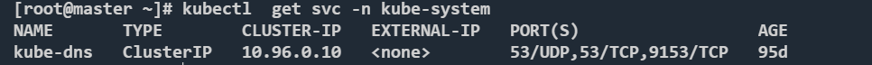

从 Kubernetes v1.12 开始，CoreDNS 是推荐的 DNS 服务器，取代了 kube-dns。 如果 你的集群原来使用 kube-dns，你可能部署的仍然是 kube-dns 而不是 CoreDNS。

>说明： CoreDNS 和 kube-dns 的 Service 都在其 metadata.name 字段使用名字 kube-dns。 这是为了能够与依靠传统 kube-dns 服务名称来解析集群内部地址的工作负载具有更好的互操作性。 使用 kube-dns 作为服务名称可以抽离共有名称之后运行的是哪个 DNS 提供程序这一实现细节。

### 四种策略
 
 * Default: Pod 从运行所在的节点继承名称解析配置。
 * ClusterFirst: 与配置的集群域后缀不匹配的任何 DNS 查询（例如 “www.kubernetes.io”） 都将转发到从节点继承的上游名称服务器。集群管理员可能配置了额外的存根域和上游 DNS 服务器。
 * ClusterFirstWithHostNet：对于以 hostNetwork 方式运行的 Pod，应显式设置其 DNS 策略 ClusterFirstWithHostNet。
 * None: 此设置允许 Pod 忽略 Kubernetes 环境中的 DNS 设置。Pod 会使用其 dnsConfig 字段 所提供的 DNS 设置。

 k8s默认使用的DNS策略是ClusterFirst，这点需要注意，也就是说域名解析会优先使用集群的DNS（kube-DNS）进行查询，如果k8s的DNS解析失败，会转发到宿主机的DNS进行解析。

 ### 解析配置

 k8s容器的域名解析和linux的域名解析是类似的，都是根据/etc/resolv.conf文件进行。

某个业务集群中的resolv.conf文件：
 ```shell
nameserver 10.96.0.10
search clusetername.svc.cluster.local svc.cluster.local cluster.local localdomain
options ndots:5
 ```
 * `nameserver`即为k8s集群中kube-dns的Service的CLUSTER-IP，该集群中容器的nameserver均为kube-dns的ip



 * `dots`是用来表示一个域名中.的个数在不小于该值的情况下会被认为是一个`FQDN`。简单说这个属性用来判断一个不是以.结束的域名在什么条件下会被认定为是一个`FQDN`
 * `search`域主要还是为了方便k8s内部服务之间的访问。比如：k8s在同一个namespace下是可以直接通过服务名称进行访问的，其原理就是会在`search`域查找，比如上面的resolv.conf中`clusetername`其实都是这个pod所在的namespace的名称。所以通过服务名称访问的时候，会和`search`域进行组合，这样最终域名会组合成servicename.namespace.svc.cluster.local。而如果是跨namespace访问，则可以通过`servicename.namespace`这样的形式，在通过和`search`域组合，依然可以得到`servicename.namespace.svc.cluster.local`

### 解析流程

 pod使用的是默认的DNS策略，即ClusterFirst，那么如果一个域名是`FQDN`，那么这个域名会被转发给DNS服务器进行解析。如果域名不是`FQDN`，那么这个域名会到`search`搜索解析，还是通过一个例子说明，比如访问abc.xyz这个域名，因为它并不是一个`FQDN`，所以它会和search域中的值进行组合而变成一个`FQDN`，然后这些域名先被kube-DNS解析，如果没有解析成功再由宿主机的DNS服务器进行解析。

所以虽然K8s 的域名全称为 `"<service-name>.<namespace>.svc.cluster.local"`，而如果是同一个namespace通常只需将 `svc_name` 当成域名就能访问到 pod，不是同一个namespace就是用`svc_name.namespace`。


> https://kubernetes.io/zh-cn/docs/tasks/administer-cluster/dns-custom-nameservers/