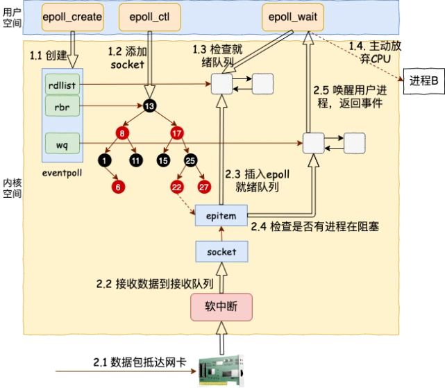

#### 流程

1. 当进程调用epoll_create时 在内核高速cache区创建一个epoll结构体，该结构体由红黑树`rbtree`(可以快速的区分出是否添加过重复事件，这个内核高速cache区，就是建立连续的物理内存页，然后在之上建立slab层,就是物理上分配好你想要的size的内存对象，每次使用时都是使用空闲的已分配好的内存。通过这棵树来管理用户进程下添加进来的所有socket连接。)和双向链表`rdlist`(就绪的描述符的链表。当有的连接就绪的时候，内核会把就绪的连接放到rdllist链表里。这样应用进程只需要判断链表就能找出就绪进程，而不用去遍历整棵树),`wq`(等待队列链表。软中断数据就绪的时候会通过wq来找到阻塞在epoll对象上的用户进程。)组成。红黑树存储着所有需要监听的事件，`rdlist`链表中存贮着将要通过epoll_wait返回给用户满足条件的事件.`wq`等待队列链表,软中断数据就绪的时候会通过wq来找到阻塞在epoll对象上的用户进程


2. 所有添加到epoll中的事件都会与设备(网卡)驱动程序建立回调关系，也就是说，当相应的事件发生时会调用这个回调方法。这个回调方法在内核中叫ep_poll_callback,它会将发生的事件添加到rdlist双链表中。当我们执行epoll_ctl时，除了把socket放到epoll文件系统里file对象对应的红黑树上之外，还会给内核中断处理程序注册一个回调函数，告诉内核，如果这个句柄的中断到了，就把它放到准备就绪list链表里。所以，当一个socket上有数据到了，内核在把网卡上的数据copy到内核中后就来把socket插入到准备就绪链表里了。


在epoll中，对于每一个事件，都会建立一个epitem结构体
```c++
struct epitem{
    struct rb_node  rbn;//红黑树节点
    struct list_head    rdllink;//双向链表节点
    struct epoll_filefd  ffd;  //事件句柄信息
    struct eventpoll *ep;    //指向其所属的eventpoll对象
    struct epoll_event event; //期待发生的事件类型
}
```
struct eventpoll对象的详细结构


3. 当调用epoll_wait检查是否有事件发生时，只需要检查eventpoll对象中的rdlist双链表中是否有epitem元素即可。如果rdlist不为空，则把发生的事件复制到用户态，同时将事件数两返回给用户，使用mmap减少复制开销




#### 触发方式


1. 水平触发的时机

* 对于读操作，只要缓冲内容不为空，LT模式返回读就绪。

* 对于写操作，只要缓冲区还不满，LT模式会返回写就绪。

当被监控的文件描述符上有可读写事件发生时，epoll_wait()会通知处理程序去读写。如果这次没有把数据一次性全部读写完(如读写缓冲区太小)，那么下次调用 epoll_wait()时，它还会通知你在上没读写完的文件描述符上继续读写，当然如果你一直不去读写，它会一直通知你。如果系统中有大量你不需要读写的就绪文件描述符，而它们每次都会返回，这样会大大降低处理程序检索自己关心的就绪文件描述符的效率。

2. 边缘触发的时机
* 对于读操作：

当缓冲区由不可读变为可读的时候，即缓冲区由空变为不空的时候。

当有新数据到达时，即缓冲区中的待读数据变多的时候。

当缓冲区有数据可读，且应用进程对相应的描述符进行EPOLL_CTL_MOD 修改EPOLLIN事件时。

* 对于写操作：

当缓冲区由不可写变为可写时。

当有旧数据被发送走，即缓冲区中的内容变少的时候。

当缓冲区有空间可写，且应用进程对相应的描述符进行EPOLL_CTL_MOD 修改EPOLLOUT事件时。

当被监控的文件描述符上有可读写事件发生时，epoll_wait()会通知处理程序去读写。如果这次没有把数据全部读写完(如读写缓冲区太小)，那么下次调用epoll_wait()时，它不会通知你，也就是它只会通知你一次，直到该文件描述符上出现第二次可读写事件才会通知你。这种模式比水平触发效率高，系统不会充斥大量你不关心的就绪文件描述符。

在ET模式下， 缓冲区从不可读变成可读，会唤醒应用进程，缓冲区数据变少的情况，则不会再唤醒应用进程。

> https://mp.weixin.qq.com/s?__biz=MzUyNzgyNzAwNg==&mid=2247483925&idx=1&sn=1ac3e863594745c7466b0e88a688b203&scene=21#wechat_redirect
https://new.qq.com/omn/20220329/20220329A09C7900.html