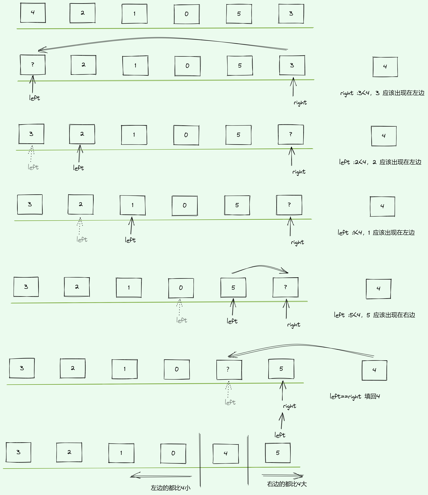

# 快速排序




```python
def quick_sort(data):
    if len(data) >= 2:  # 递归入口及出口
        mid = data[len(data) // 2]  # 选取基准值，也可以选取第一个或最后一个元素
        left, right = [], []  # 定义基准值左右两侧的列表
        data.remove(mid)  # 从原始数组中移除基准值
        for num in data:
            if num >= mid:
                right.append(num)
            else:
                left.append(num)
        return quick_sort(left) + [mid] + quick_sort(right)
    else:
        return data
```

# 示例：
```
array = [2, 3, 5, 7, 1, 4, 6, 15, 5, 2, 7, 9, 10, 15, 9, 17, 12]
print(quick_sort(array))
# 输出为[1, 2, 2, 3, 4, 5, 5, 6, 7, 7, 9, 9, 10, 12, 15, 15, 17]
```
```golang
import (
   "fmt"
)

func main(){
   array := []int{3, 6, 1, 4, 2, 8}
   fmt.Println(array)
   quickSort(array, 0, len(array)-1)
   fmt.Println(array)
}

func quickSort(array []int, left, right int) {
   if left >= right {
      fmt.Println("return:",array)
      return
   }
   index := partition(array,left,right)
   quickSort(array, left, index - 1)
   quickSort(array, index + 1, right)
}

func partition(array []int, left, right int) int {
   baseNum := array[left]
   for left < right{
      for (array[right] >= baseNum && right > left){
         right--
      }
      array[left] = array[right]
      for (array[left] <=baseNum && right > left) {
         left++
         }
      array[right] = array[left]
   }
   array[right] = baseNum
   return right
}

```
